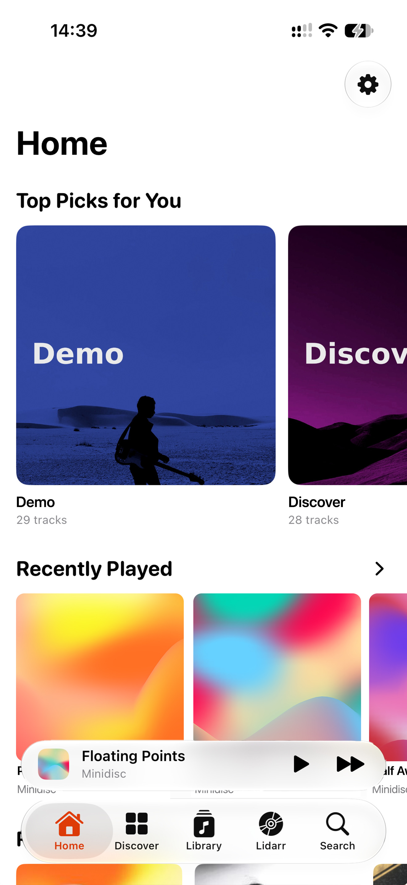
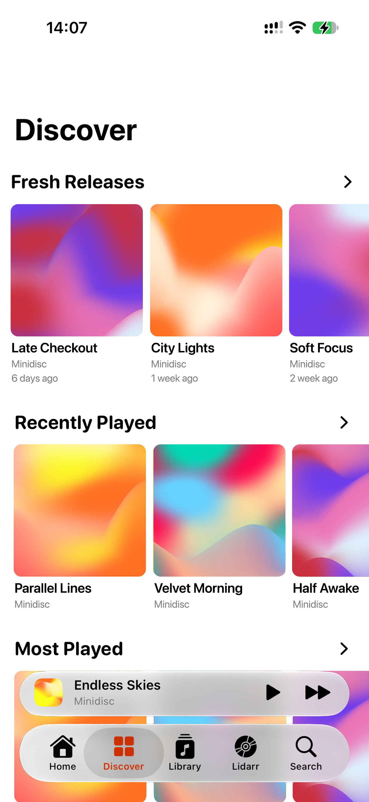
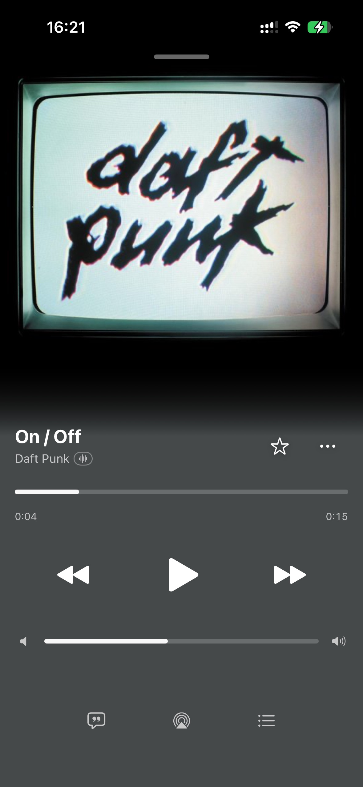
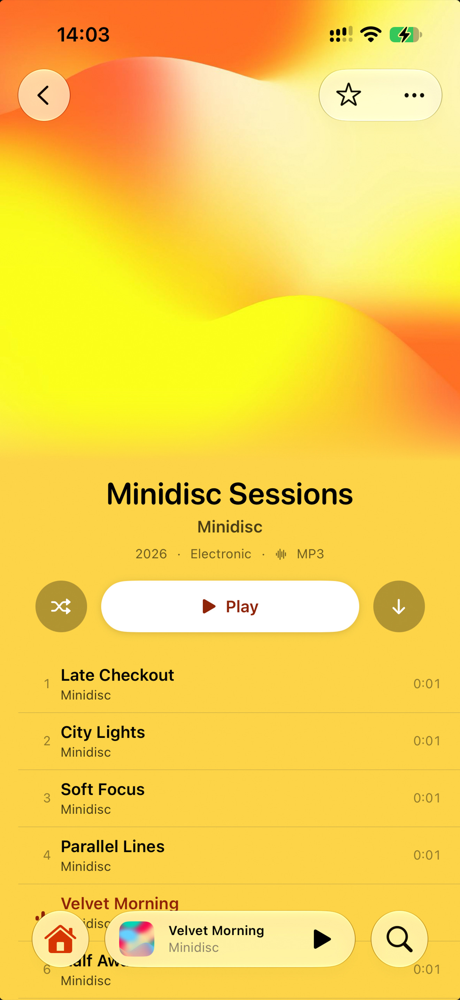
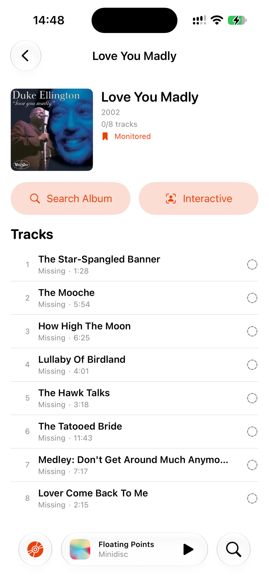

# Minidisc

> Minidisc is an opinionated music player for iOS that plays the music from your own server, and it gives you an experience that is close to Apple Music.

[](LICENSE)
[](#requirements)
[](https://swift.org)

## Screenshots

|                        Home                        |                        Discover                        |                        Player                        |                        Album                        |                           Lidarr                           |
| :------------------------------------------------: | :----------------------------------------------------: | :--------------------------------------------------: | :-------------------------------------------------: | :--------------------------------------------------------: |
|  |  |  |  |  |

## What is Minidisc?

Minidisc is a music player for iOS, written in Swift and SwiftUI, that plays the music from your own server. It uses the Subsonic and OpenSubsonic API, so it works with [Navidrome](https://www.navidrome.org) and with other servers that follow these standards.

Minidisc does not use accounts or subscriptions, and it does not track you, so your music stays between your device and your server. It gives you the same smooth experience as Apple Music, but it plays the music that you own.

## An opinionated fork

Minidisc is a fork of [Cassette](https://github.com/CassetteLab/cassette), which Mathieu Dubart wrote as a good client for iOS and macOS. Minidisc takes a different, narrower path, and it follows four rules:

- **iOS only.** Minidisc does not support macOS, because each screen is made for the phone.
- **Opinionated.** Minidisc has few settings and good defaults, because it makes the decisions for you and keeps the interface simple.
- **Smooth first.** Minidisc adds a function only when the function feels as good as Apple Music.
- **Familiar.** The tab bar, the mini-player, the player screen, and the Home shelves use the usual iOS patterns, so you do not have to learn them.

If you want the largest set of functions on Mac and iPhone, use Cassette. If you want the simplest iOS player for your own library, use Minidisc.

## Features

**A player that is close to Apple Music**

- Native iOS 26 design with Liquid Glass.
- A full-screen player with a large cover.
- A mini-player that stays in the tab bar, and you tap it to open the full player.
- A Home screen with your top picks, your recent music, and one shelf for each genre.
- Background playback with lock screen and Control Center controls.
- AirPlay support.

**Your library**

- Browse your playlists, artists, albums, downloads, and favorites.
- Search all of your library.
- Offline mode, so you can download albums, playlists, or single tracks.
- Sync your favorites with the server.
- Lyrics, shuffle, repeat, and a full queue.
- The app keeps your session and continues from the last position.

**More functions**

- **Wrapped** gives you a summary of your year of listening.
- **ListenBrainz** scrobbles your plays and gets recommendations for you.
- **AudioMuse-AI** builds weekly mood playlists from the sound of your music.
- **Lidarr** manages your music collection from the app: add artists, monitor and search for missing albums, pick releases with an interactive search, and follow the download queue with manual import.
- **Streaming quality** is lossless by default, but you can pick a lighter format per network (Wi-Fi and cellular).

**Privacy**

- All traffic goes directly to your server, and Minidisc does not track you.
- Minidisc keeps your credentials only in the iOS Keychain.
- Minidisc can send custom HTTP headers for a server behind a reverse proxy, for example Cloudflare Access or Authelia.

## Installation

### iOS: sideload the app

1. Download the `.ipa` file from the [Releases](../../releases) page.
2. Install the file with AltStore, Sideloadly, or a different sideload tool. The tool signs the app with your Apple ID during the installation.

### Build from the source

You need these items:

- macOS 15 or later, with Xcode 26 or later.
- A Subsonic, OpenSubsonic, or Navidrome server.
- An Apple Developer account. The free level is sufficient for a personal build.

Do these steps:

1. Clone the repository and open the project.
    ```bash
    git clone https://github.com/Loriage/Minidisc.git
    cd Minidisc
    open Minidisc.xcodeproj
    ```
    Swift Package Manager gets the dependencies (SwiftSonic), so you do not have to do more setup.
2. Select your team in **Signing & Capabilities**.
3. Select an iOS 26 device or simulator.
4. Build and run the app when you press Command-R.
5. At the first start, Minidisc asks for your server address, your username, and your password. Enter them and tap **Connect**. If your server is behind a reverse proxy that needs custom headers, open **Advanced** and add the headers.

## Requirements

- iOS 26.1 or later.
- A Subsonic, OpenSubsonic, or Navidrome server.

## Server compatibility

Minidisc works with each server that has the Subsonic or OpenSubsonic API. Navidrome is the recommended server, and the team tests Minidisc primarily with Navidrome. If your server has the Subsonic API but a function does not work, [open an issue](https://github.com/Loriage/Minidisc/issues).

## Architecture

This information is for developers:

- **UI.** SwiftUI views with `@Observable @MainActor` view models, and the views have no business logic.
- **Services.** Swift actors, for example `PlayerService` and `LibraryService`, that do not import SwiftUI or UIKit.
- **Playback.** A two-deck `AVPlayer` engine (`AVPlayerEngine`) for gapless playback, real crossfades, and ReplayGain, which connects to `MPNowPlayingInfoCenter` and `MPRemoteCommandCenter`.
- **Subsonic API.** [SwiftSonic](https://github.com/CassetteLab/swiftsonic) does all server communication.
- **Integrations.** ListenBrainz, AudioMuse-AI, and Lidarr each have their own client and settings.
- **Persistence.** SwiftData for the app data, and Keychain for the credentials.
- **Concurrency.** Swift 6 strict concurrency.
- **Dependencies.** SwiftSonic, and there are no other dependencies.

## License

Minidisc uses the [MPL-2.0](LICENSE) license.

- You can use, study, change, and share the source.
- Changed files stay under MPL-2.0, but you can combine them with proprietary code in a larger work.

Dependencies: [SwiftSonic](https://github.com/CassetteLab/swiftsonic) (MIT), which is compatible with MPL-2.0.

> Code before commit 21f9227 used the GPL-3.0-or-later license.

## Acknowledgments

- [Cassette](https://github.com/CassetteLab/cassette) by Mathieu Dubart, because Minidisc is a fork of Cassette.
- The [Navidrome](https://www.navidrome.org) team, because Navidrome is an excellent self-hosted music server.
- The [OpenSubsonic](https://opensubsonic.netlify.app) community, because they modernized the Subsonic API.
